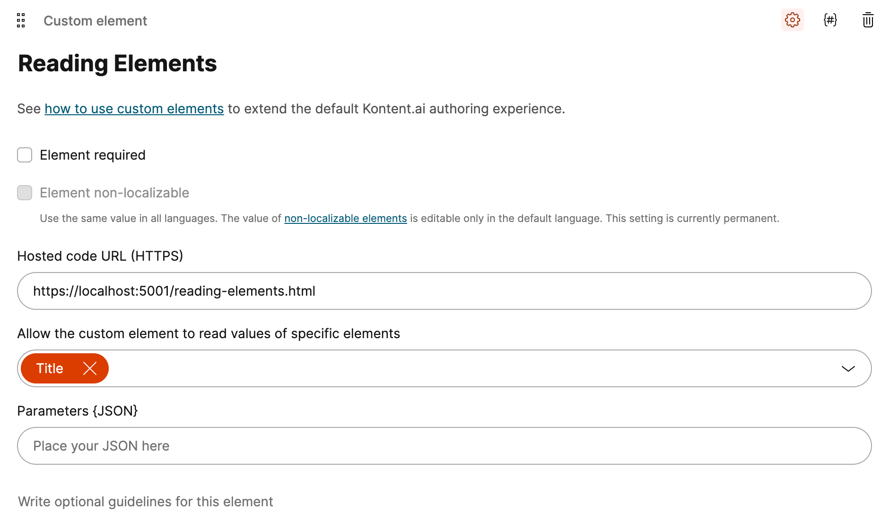

# Kontent.ai Custom Element Samples

A collection of simple custom elements for Kontent.ai to demonstrate the capabilities of the Kontent.ai Custom Element and the Kontent.ai Custom Element SDK.

The examples are written in vanilla JavaScript and are intended to be used as a starting point for your own custom elements. Where necessary, the examples will use JQuery to simplify the code.

## Instructions

1. Clone the repository.
1. From the command line in the `src` directory, run `dotnet serve -S -p 5001` (or similar command) to serve the files
1. Use the custom element URL in the Kontent.ai Custom Element configuration. Specific examples are below with any further required instructions.

## Custom Elements

1. [Simple Text Input](#simple-text)
1. [Reading Elements](#reading-elements)
1. [3rd Party API Integration](#3rd-party-api)

### Simple Text Input 

Contains a basic text input element that can be used to store a single line of text. This illustrates the basic structure of a custom element. Changing the element between **Required** and **Optional** will change the validation of the element.

In the two screenshots below, the first shows the element with a value and the second shows the element without a value. The second screenshot shows the element as **Required** and so is marked as incomplete.

### Reading Elements 

Takes the example further by reading information about the element and the content item. This example shows how to read the element name, the element codename, the content item name and the content item codename.

Before you use this example, you will need to create a content type with a text element called `title`, and will need to make sure that when you create the custom element, you allow it to read this element.  I.e.:

Everything in this element occus on initialisation, so the element does not need to be saved to see the results. When the element is loaded, we use the [getItemDetails method](https://kontent.ai/learn/reference/custom-elements-js-api/#a-getitemdetails-method) in combination with the [context](https://kontent.ai/learn/reference/custom-elements-js-api/#a-context-object) to get the content item details. 

We also use the [getElementValue method](https://kontent.ai/learn/reference/custom-elements-js-api/#a-getelementvalue-method) to get the `title` element value. The results are then displayed in the element.

### 3rd Party API Integration 

Show a simple case of an external API beng used to provide data to the custom element. This example uses the Open Breweries API to provide a list of breweries in Alask (why not?). The user can select a brewery from the list and the custom element will store the brewery details.